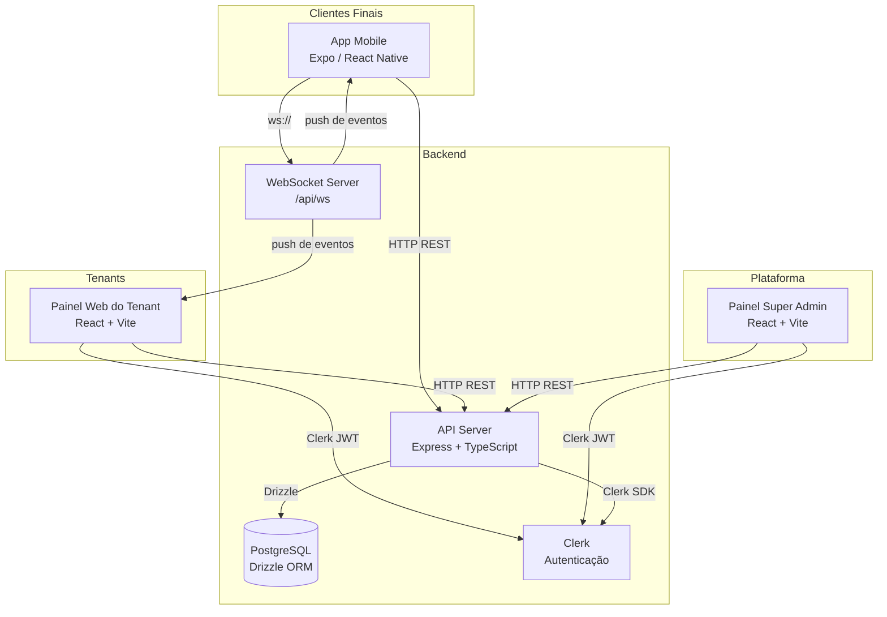
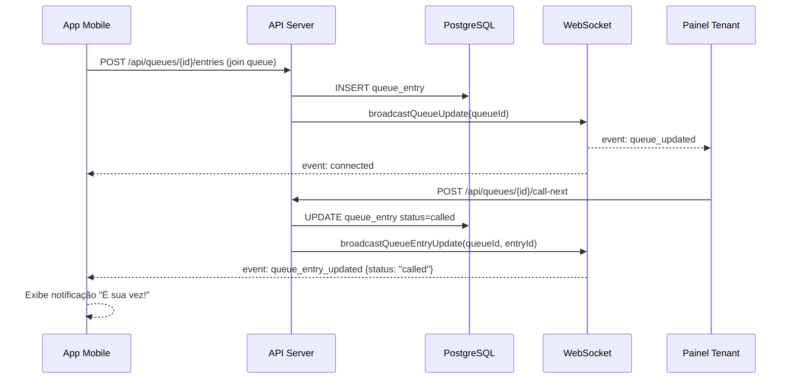
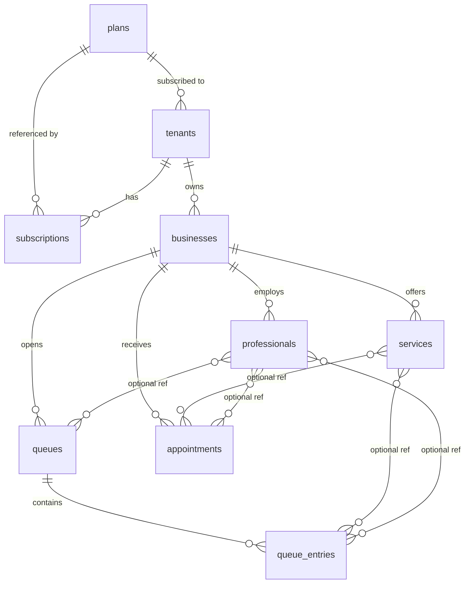
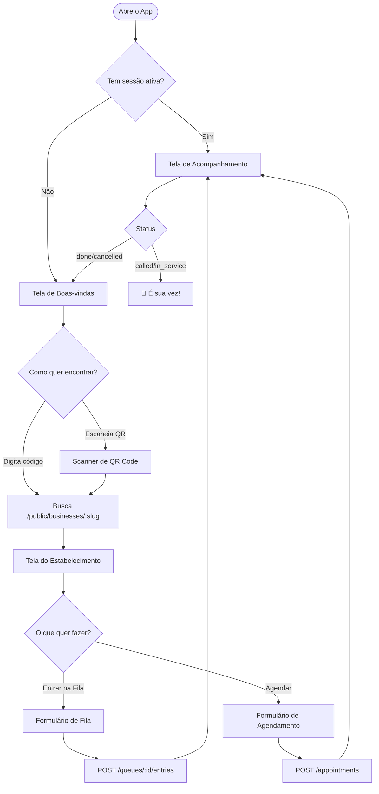

# Documentação do Projeto — Queue & Appointment SaaS

## Índice

1. [Visão Geral](#1-visão-geral)
2. [Arquitetura](#2-arquitetura)
3. [Stack Tecnológica](#3-stack-tecnológica)
4. [Artefatos e Estrutura do Monorepo](#4-artefatos-e-estrutura-do-monorepo)
5. [Banco de Dados](#5-banco-de-dados)
6. [API REST](#6-api-rest)
7. [WebSocket](#7-websocket)
8. [Painel do Tenant](#8-painel-do-tenant)
9. [Painel Super Admin](#9-painel-super-admin)
10. [App Mobile do Cliente](#10-app-mobile-do-cliente)
11. [Autenticação e Autorização](#11-autenticação-e-autorização)
12. [Fluxos de Uso](#12-fluxos-de-uso)

---

## 1. Visão Geral

Plataforma SaaS **multi-tenant** para gestão de filas digitais e agendamentos voltada a pequenos e médios negócios (barbearias, clínicas, salões, etc.).

Cada cliente da plataforma (chamado de **tenant**) possui um ou mais estabelecimentos (**businesses**). O tenant gerencia serviços, profissionais, filas e agendamentos pelo **Painel Web**. Os clientes finais dos estabelecimentos usam o **App Mobile** para entrar em filas ou agendar horários, sem necessidade de cadastro.

O **Super Admin** administra a plataforma globalmente: cria planos, cadastra tenants e monitora métricas de uso.

---

## 2. Arquitetura

### Diagrama Geral



### Fluxo de Dados (Fila em Tempo Real)



---

## 3. Stack Tecnológica

| Camada | Tecnologia |
|--------|-----------|
| **Backend — Runtime** | Node.js + TypeScript |
| **Backend — Framework** | Express.js |
| **Backend — WebSocket** | `ws` (nativo, sem Socket.IO) |
| **Backend — Logs** | Pino + pino-http |
| **Banco de Dados** | PostgreSQL |
| **ORM** | Drizzle ORM + drizzle-zod |
| **Autenticação** | Clerk (JWT via `@clerk/express`) |
| **Frontend Web** | React + Vite + TypeScript |
| **Roteamento Web** | Wouter |
| **Queries HTTP (Web)** | TanStack Query (React Query) |
| **UI Web** | shadcn/ui + Tailwind CSS + Radix UI |
| **App Mobile** | Expo + React Native + TypeScript |
| **Roteamento Mobile** | Expo Router (file-based) |
| **Queries HTTP (Mobile)** | TanStack Query |
| **Ícones Mobile** | `@expo/vector-icons` (Feather) |
| **Spec da API** | OpenAPI 3.1 (YAML) |
| **Client HTTP gerado** | `@workspace/api-client-react` (gerado via openapi-fetch) |
| **Gerenciador de Pacotes** | pnpm workspaces |

---

## 4. Artefatos e Estrutura do Monorepo

```
/
├── artifacts/
│   ├── api-server/          # Backend Express (API REST + WebSocket)
│   ├── tenant-panel/        # SPA React — painel de gestão do tenant
│   ├── super-admin-panel/   # SPA React — painel do administrador da plataforma
│   ├── customer-app/        # App Expo — app mobile do cliente final
│   └── mockup-sandbox/      # Canvas de design / protótipos
│
├── lib/
│   ├── db/                  # Schema Drizzle e cliente PostgreSQL compartilhado
│   ├── api-spec/            # openapi.yaml — fonte da verdade da API
│   └── api-client-react/    # Hooks React Query gerados a partir do OpenAPI
│
└── docs/
    └── README.md            # Esta documentação
```

### Pacotes Detalhados

| Pacote | Caminho | Propósito |
|--------|---------|-----------|
| `api-server` | `artifacts/api-server` | Servidor HTTP/WS. Expõe todos os endpoints REST e o servidor WebSocket em `/api/ws`. |
| `tenant-panel` | `artifacts/tenant-panel` | SPA para o dono/operador do estabelecimento. Autenticada via Clerk. Preview em `/`. |
| `super-admin-panel` | `artifacts/super-admin-panel` | SPA para o administrador da plataforma. Autenticada via Clerk com role `super_admin`. Preview em `/super-admin/`. |
| `customer-app` | `artifacts/customer-app` | App Expo para o cliente final. Acesso anônimo. Preview em `/customer-app/`. |
| `@workspace/db` | `lib/db` | Schema Drizzle (`plans`, `tenants`, `businesses`, etc.) e instância do cliente Drizzle/PostgreSQL. |
| `@workspace/api-spec` | `lib/api-spec` | Arquivo `openapi.yaml` com toda a especificação da API. |
| `@workspace/api-client-react` | `lib/api-client-react` | Hooks React Query (`useListBusinesses`, `useJoinQueue`, etc.) gerados automaticamente a partir do OpenAPI. |

---

## 5. Banco de Dados

O banco é PostgreSQL gerenciado via **Drizzle ORM**. Todos os IDs são UUIDs gerados no servidor (`crypto.randomUUID()`). O campo `tenantId` presente na maioria das tabelas garante o isolamento multi-tenant.

### Diagrama de Relacionamentos



### Tabelas

#### `plans`
Planos SaaS disponíveis na plataforma.

| Coluna | Tipo | Descrição |
|--------|------|-----------|
| `id` | text (PK) | UUID |
| `name` | text | Nome do plano (ex: "Starter") |
| `slug` | text (unique) | Identificador URL-safe |
| `description` | text | Descrição opcional |
| `max_businesses` | integer | Limite de estabelecimentos por tenant |
| `max_operators` | integer | Limite de operadores |
| `max_queues_per_day` | integer | Limite de filas abertas por dia |
| `price` | integer | Preço em centavos |
| `status` | enum | `active` \| `inactive` |
| `created_at` / `updated_at` | timestamp | Timestamps |

#### `tenants`
Clientes da plataforma SaaS (negócios assinantes).

| Coluna | Tipo | Descrição |
|--------|------|-----------|
| `id` | text (PK) | UUID |
| `name` | text | Nome do tenant |
| `slug` | text (unique) | Identificador URL-safe |
| `plan_id` | text (FK → plans) | Plano atual |
| `status` | enum | `active` \| `trial` \| `suspended` \| `cancelled` |
| `owner_clerk_id` | text | ID do usuário no Clerk (dono) |
| `email` | text | Email de contato |
| `phone` | text | Telefone opcional |
| `created_at` / `updated_at` | timestamp | Timestamps |

#### `subscriptions`
Histórico de assinaturas de cada tenant.

| Coluna | Tipo | Descrição |
|--------|------|-----------|
| `id` | text (PK) | UUID |
| `tenant_id` | text (FK → tenants) | Tenant |
| `plan_id` | text (FK → plans) | Plano contratado |
| `status` | enum | `active` \| `trial` \| `cancelled` \| `past_due` \| `paused` |
| `current_period_start` | timestamp | Início do período vigente |
| `current_period_end` | timestamp | Fim do período vigente |
| `trial_ends_at` | timestamp | Fim do trial |
| `cancelled_at` | timestamp | Data de cancelamento |

#### `businesses`
Estabelecimentos pertencentes a um tenant.

| Coluna | Tipo | Descrição |
|--------|------|-----------|
| `id` | text (PK) | UUID |
| `tenant_id` | text (FK → tenants) | Tenant dono |
| `name` | text | Nome do estabelecimento |
| `slug` | text (unique) | Código público (usado pelo app mobile) |
| `description` | text | Descrição opcional |
| `category` | text | Categoria (ex: "barbershop") |
| `address` | text | Endereço opcional |
| `phone` | text | Telefone opcional |
| `opening_hours` | text | Horário de funcionamento (texto livre) |

#### `services`
Serviços oferecidos por um estabelecimento.

| Coluna | Tipo | Descrição |
|--------|------|-----------|
| `id` | text (PK) | UUID |
| `tenant_id` | text (FK → tenants) | Tenant |
| `business_id` | text (FK → businesses) | Estabelecimento |
| `name` | text | Nome do serviço |
| `description` | text | Descrição opcional |
| `duration_minutes` | integer | Duração estimada em minutos |
| `is_active` | boolean | Se está disponível para seleção |

#### `professionals`
Profissionais/operadores de um estabelecimento.

| Coluna | Tipo | Descrição |
|--------|------|-----------|
| `id` | text (PK) | UUID |
| `tenant_id` | text (FK → tenants) | Tenant |
| `business_id` | text (FK → businesses) | Estabelecimento |
| `clerk_id` | text | ID no Clerk (opcional — para login no painel) |
| `name` | text | Nome do profissional |
| `role` | text | Cargo (ex: "operator", "barber") |
| `avatar_url` | text | URL do avatar |
| `is_active` | boolean | Se está ativo |

#### `queues`
Filas abertas para um estabelecimento em uma data.

| Coluna | Tipo | Descrição |
|--------|------|-----------|
| `id` | text (PK) | UUID |
| `tenant_id` | text (FK → tenants) | Tenant |
| `business_id` | text (FK → businesses) | Estabelecimento |
| `service_id` | text (FK → services) | Serviço opcional |
| `professional_id` | text (FK → professionals) | Profissional opcional |
| `date` | date | Data da fila (YYYY-MM-DD) |
| `status` | enum | `open` \| `paused` \| `closed` |
| `current_ticket` | integer | Número do ticket sendo atendido |
| `last_ticket` | integer | Último número emitido |
| `avg_wait_minutes` | integer | Tempo médio de espera calculado |

#### `queue_entries`
Entradas (clientes) em uma fila.

| Coluna | Tipo | Descrição |
|--------|------|-----------|
| `id` | text (PK) | UUID |
| `tenant_id` | text (FK → tenants) | Tenant |
| `queue_id` | text (FK → queues) | Fila |
| `ticket_number` | integer | Número sequencial do ticket |
| `client_name` | text | Nome do cliente |
| `client_phone` | text | Telefone opcional |
| `service_id` | text (FK → services) | Serviço selecionado |
| `professional_id` | text (FK → professionals) | Profissional preferido |
| `status` | enum | `waiting` \| `called` \| `in_service` \| `done` \| `cancelled` \| `no_show` |
| `called_at` | timestamp | Quando foi chamado |
| `served_at` | timestamp | Quando o serviço começou |
| `finished_at` | timestamp | Quando terminou |
| `notes` | text | Observações do operador |

#### `appointments`
Agendamentos com hora marcada.

| Coluna | Tipo | Descrição |
|--------|------|-----------|
| `id` | text (PK) | UUID |
| `tenant_id` | text (FK → tenants) | Tenant |
| `business_id` | text (FK → businesses) | Estabelecimento |
| `service_id` | text (FK → services) | Serviço opcional |
| `professional_id` | text (FK → professionals) | Profissional opcional |
| `client_name` | text | Nome do cliente |
| `client_phone` | text | Telefone opcional |
| `scheduled_at` | timestamp | Data e hora do agendamento |
| `status` | enum | `scheduled` \| `confirmed` \| `in_service` \| `done` \| `cancelled` \| `no_show` |
| `notes` | text | Observações |
| `cancel_reason` | text | Motivo do cancelamento |
| `confirmed_at` / `started_at` / `finished_at` | timestamp | Timestamps de ciclo de vida |

---

## 6. API REST

Base URL: `/api`

Convenções de autenticação:
- **Público** — sem token, acesso anônimo
- **Autenticado** — requer Bearer token JWT do Clerk (`Authorization: Bearer <token>`)
- **Tenant** — autenticado + role `tenant_admin` ou `operator`
- **Super Admin** — autenticado + role `super_admin`

### Endpoints Completos

#### Health

| Método | Caminho | Auth | Descrição |
|--------|---------|------|-----------|
| GET | `/healthz` | Público | Verificação de saúde do servidor |

#### Planos

| Método | Caminho | Auth | Descrição |
|--------|---------|------|-----------|
| GET | `/plans` | Público | Lista todos os planos SaaS |
| POST | `/plans` | Super Admin | Cria novo plano |
| GET | `/plans/{id}` | Público | Busca plano por ID |
| PUT | `/plans/{id}` | Super Admin | Atualiza plano |
| DELETE | `/plans/{id}` | Super Admin | Remove plano |

#### Tenants

| Método | Caminho | Auth | Descrição |
|--------|---------|------|-----------|
| GET | `/tenants` | Super Admin | Lista todos os tenants (filtros: `status`, `planId`) |
| POST | `/tenants` | Super Admin | Cria novo tenant |
| GET | `/tenants/me` | Tenant | Retorna o tenant do usuário autenticado |
| GET | `/tenants/{id}` | Super Admin | Busca tenant por ID |
| PUT | `/tenants/{id}` | Tenant / Super Admin | Atualiza dados do tenant |
| PATCH | `/tenants/{id}/status` | Super Admin | Altera status do tenant |

#### Estabelecimentos (Businesses)

| Método | Caminho | Auth | Descrição |
|--------|---------|------|-----------|
| GET | `/businesses` | Tenant | Lista estabelecimentos do tenant autenticado |
| POST | `/businesses` | Tenant | Cria estabelecimento |
| GET | `/businesses/{id}` | Tenant | Busca estabelecimento por ID |
| PUT | `/businesses/{id}` | Tenant | Atualiza estabelecimento |
| DELETE | `/businesses/{id}` | Tenant | Remove estabelecimento |

#### Serviços

| Método | Caminho | Auth | Descrição |
|--------|---------|------|-----------|
| GET | `/businesses/{businessId}/services` | Tenant | Lista serviços do estabelecimento |
| POST | `/businesses/{businessId}/services` | Tenant | Cria serviço |
| PUT | `/businesses/{businessId}/services/{id}` | Tenant | Atualiza serviço |
| DELETE | `/businesses/{businessId}/services/{id}` | Tenant | Remove serviço |

#### Profissionais

| Método | Caminho | Auth | Descrição |
|--------|---------|------|-----------|
| GET | `/businesses/{businessId}/professionals` | Tenant | Lista profissionais |
| POST | `/businesses/{businessId}/professionals` | Tenant | Cria profissional |
| PUT | `/businesses/{businessId}/professionals/{id}` | Tenant | Atualiza profissional |
| DELETE | `/businesses/{businessId}/professionals/{id}` | Tenant | Remove profissional |

#### Filas (Queues)

| Método | Caminho | Auth | Descrição |
|--------|---------|------|-----------|
| GET | `/queues` | Tenant | Lista filas de um estabelecimento (params: `businessId`, `date`) |
| POST | `/queues` | Tenant | Abre nova fila para hoje |
| GET | `/queues/{id}` | Tenant | Busca fila com suas entradas |
| PATCH | `/queues/{id}/status` | Tenant | Abre, pausa ou fecha a fila |
| POST | `/queues/{id}/call-next` | Tenant | Chama o próximo cliente na fila |

#### Entradas de Fila (Queue Entries)

| Método | Caminho | Auth | Descrição |
|--------|---------|------|-----------|
| GET | `/queues/{queueId}/entries` | Tenant | Lista entradas (filtro: `status`) |
| POST | `/queues/{queueId}/entries` | Público | Cliente entra na fila (anônimo) |
| GET | `/queues/{queueId}/entries/{id}` | Público | Consulta status da entrada |
| PATCH | `/queues/{queueId}/entries/{id}` | Tenant | Atualiza status da entrada |

#### Agendamentos (Appointments)

| Método | Caminho | Auth | Descrição |
|--------|---------|------|-----------|
| GET | `/appointments` | Tenant | Lista agendamentos (params: `businessId`, `date`, `professionalId`, `status`) |
| POST | `/appointments` | Público | Cria agendamento (cliente anônimo) |
| GET | `/appointments/{id}` | Público | Consulta agendamento por ID |
| PATCH | `/appointments/{id}` | Tenant | Atualiza status do agendamento |
| GET | `/appointments/available-slots` | Público | Lista horários disponíveis (params: `businessId`, `date`, `serviceId?`, `professionalId?`) |

#### Endpoints Públicos (App Mobile)

| Método | Caminho | Auth | Descrição |
|--------|---------|------|-----------|
| GET | `/public/businesses/{slug}` | Público | Busca estabelecimento por slug (retorna serviços e profissionais) |
| GET | `/public/businesses/{slug}/queues` | Público | Lista filas abertas do estabelecimento |

#### Estatísticas

| Método | Caminho | Auth | Descrição |
|--------|---------|------|-----------|
| GET | `/stats/saas` | Super Admin | Métricas globais da plataforma |
| GET | `/stats/tenant` | Tenant | Métricas do tenant autenticado (param: `businessId?`) |

---

## 7. WebSocket

**Endpoint:** `ws://<host>/api/ws`

O servidor WebSocket permite que clientes se inscrevam em atualizações em tempo real de uma entrada de fila ou de um agendamento específico. A conexão é somente leitura — o servidor empurra eventos, o cliente não envia mensagens.

### Conexão

A URL de conexão deve incluir parâmetros de query:

**Monitorar entrada de fila:**
```
ws://<host>/api/ws?type=queue&queueId=<uuid>&entryId=<uuid>
```

**Monitorar agendamento:**
```
ws://<host>/api/ws?type=appointment&appointmentId=<uuid>
```

Se os parâmetros forem inválidos ou ausentes, a conexão é encerrada com código `1008`.

### Eventos Emitidos pelo Servidor

| Evento | Quando é enviado | Payload |
|--------|-----------------|---------|
| `connected` | Imediatamente após conexão bem-sucedida | `{}` |
| `queue_entry_updated` | Quando o status de uma entrada específica muda | Objeto `QueueEntry` completo |
| `queue_updated` | Quando a fila avança (call-next, nova entrada) | Objeto `Queue` com `entries` |
| `appointment_updated` | Quando o status do agendamento muda | Objeto `Appointment` completo |

### Comportamento de Fallback (App Mobile)

O app mobile tenta conectar via WebSocket. Se a conexão não estiver disponível (`wsStatus === "fallback"`), o app automaticamente alterna para **polling** com intervalo de 5 segundos, garantindo que o usuário sempre veja dados atualizados.

---

## 8. Painel do Tenant

**Preview path:** `/`  
**Autenticação:** Clerk (hash routing)

### Rotas da SPA

| Rota | Componente | Descrição |
|------|-----------|-----------|
| `/` ou `/dashboard` | `Dashboard` | Visão geral com estatísticas (atendidos hoje, em espera, agendamentos) |
| `/queue` ou `/queues` | `QueuePage` | Gestão de filas: abrir, pausar, fechar, chamar próximo e ver clientes na fila |
| `/appointments` | `AppointmentsPage` | Calendário e lista de agendamentos com filtros por data e profissional |
| `/businesses` | `Businesses` | Cadastro e listagem de estabelecimentos do tenant |
| `/services` | `ServicesPage` | Gerenciar catálogo de serviços por estabelecimento |
| `/professionals` | `ProfessionalsPage` | Cadastrar e editar profissionais/operadores |
| `/settings` | `SettingsPage` | Configurações do tenant (dados, plano atual) |
| `/sign-in` | `SignInRoute` | Tela de login Clerk (somente visitantes) |
| `/sign-up` | `SignUpRoute` | Tela de cadastro Clerk (somente visitantes) |

### Fluxo de Autenticação

1. Usuário acessa qualquer rota — Clerk verifica se há sessão ativa.
2. Se **não autenticado** → redireciona para `/sign-in`.
3. Após login bem-sucedido → redireciona para `/dashboard`.
4. O token JWT do Clerk é enviado automaticamente nas chamadas à API via `Authorization: Bearer`.
5. A API identifica o tenant via `ownerClerkId` ou via metadata do token (`tenantId`, `role`).

---

## 9. Painel Super Admin

**Preview path:** `/super-admin/`  
**Autenticação:** Clerk + role `super_admin` nos metadados da sessão

### Rotas da SPA

| Rota | Componente | Descrição |
|------|-----------|-----------|
| `/` ou `/dashboard` | `Dashboard` | Métricas globais: total de tenants, ativos, em trial, suspensos, filas e agendamentos do dia |
| `/tenants` | `TenantsPage` | Lista de todos os tenants com filtros por status e plano; botão para criar novo tenant |
| `/tenants/:id` | `TenantDetailPage` | Detalhes de um tenant: dados, plano atual, histórico de assinaturas, ação de alterar plano e status |
| `/plans` | `PlansPage` | CRUD completo de planos SaaS (nome, preço, limites) |
| `/sign-in` | `SignInRoute` | Login Clerk (somente visitantes) |

### Token de API

O componente `ApiAuthSetup` registra automaticamente um getter de token via `setAuthTokenGetter(() => getToken())`, que é injetado em todas as chamadas do `@workspace/api-client-react`, garantindo autenticação transparente.

---

## 10. App Mobile do Cliente

**Preview path:** `/customer-app/`  
**Tecnologia:** Expo + React Native + Expo Router  
**Autenticação:** Nenhuma — acesso totalmente anônimo

### Telas (file-based routing com Expo Router)

| Arquivo | Rota | Descrição |
|---------|------|-----------|
| `app/index.tsx` | `/` | **Boas-vindas** — campo para digitar código do negócio ou botão para escanear QR code |
| `app/scan.tsx` | `/scan` | **Scanner QR** — lê QR code gerado pelo tenant e navega automaticamente para a tela do negócio |
| `app/business.tsx` | `/business` | **Estabelecimento** — nome, descrição, lista de serviços e profissionais, botões "Entrar na Fila" e "Agendar" |
| `app/join-queue.tsx` | `/join-queue` | **Entrar na Fila** — formulário com nome, telefone (opcional), serviço e profissional preferido |
| `app/book.tsx` | `/book` | **Agendar** — formulário de agendamento com seleção de data, horário disponível, serviço e profissional |
| `app/track.tsx` | `/track` | **Acompanhar** — monitora em tempo real a posição na fila ou o status do agendamento |
| `app/_layout.tsx` | (layout raiz) | Configuração global: fontes, providers, SafeAreaProvider |
| `app/+not-found.tsx` | `*` | Tela 404 |

### Fluxo Completo do Cliente



### Atualizações em Tempo Real (Track Screen)

A tela `/track` implementa uma estratégia híbrida:

1. **WebSocket** (preferencial): conecta em `ws://<host>/api/ws?type=queue&queueId=...&entryId=...` ou `?type=appointment&appointmentId=...`.
2. **Polling** (fallback): se o WebSocket não conectar em tempo hábil, ativa polling a cada 5 segundos via `setInterval`.
3. O badge de status exibe "Live" (WebSocket ativo), "Polling" (fallback) ou "Connecting..." conforme o estado da conexão.
4. Quando o status muda para `called` ou `in_service`, o app exibe um banner de destaque e dispara feedback háptico.

---

## 11. Autenticação e Autorização

### Clerk

O projeto usa **Clerk** como provedor de identidade para todos os usuários autenticados (tenants e super admins). O cliente Clerk é proxy-ado pelo próprio backend (via `clerkProxyMiddleware`) para evitar problemas de CORS e HTTPS em ambientes de desenvolvimento.

### Roles e Permissões

Os roles são armazenados nos **metadados de sessão do Clerk** (`sessionClaims.metadata`) e lidos pelo middleware `auth.ts` a cada requisição:

| Role | Quem tem | Permissões |
|------|---------|-----------|
| `super_admin` | Administrador da plataforma | Acesso total: criar/editar tenants, planos, ver métricas globais |
| `tenant_admin` | Dono do estabelecimento | CRUD de seus próprios recursos (businesses, services, professionals, queues, appointments) |
| `operator` | Funcionário cadastrado como `professional` com `clerkId` | Acesso ao business vinculado; operações de fila e agendamento |
| _(anônimo)_ | Cliente final no app mobile | Apenas endpoints públicos: lookup de negócio, entrar na fila, criar agendamento, acompanhar status |

### Lógica de Identificação (loadUserContext)

O middleware `loadUserContext` opera assim:

1. Lê `sessionClaims.metadata.role` e `sessionClaims.metadata.tenantId` do JWT.
2. Se `role === "super_admin"` → define `req.role = "super_admin"`.
3. Se `role === "tenant_admin"` + `tenantId` → define `req.role = "tenant_admin"` e `req.tenantId`.
4. Se `role === "operator"` + `tenantId` → define `req.role = "operator"`, `req.tenantId` e `req.businessId`.
5. **Fallback por banco** — se os metadados não estiverem preenchidos:
   - Busca `tenantsTable` onde `ownerClerkId = userId` → trata como `tenant_admin`.
   - Busca `professionalsTable` onde `clerkId = userId` → trata como `operator`.

### Isolamento Multi-Tenant

Todas as queries do banco filtram por `tenantId` derivado do contexto da requisição. Um tenant nunca pode ver ou modificar dados de outro tenant — o isolamento é aplicado na camada de repositório, não apenas nas rotas.

### Acesso Anônimo (Clientes)

Clientes finais não se autenticam. Os endpoints públicos (`/public/...`, `POST /queues/:id/entries`, `POST /appointments`, `GET /appointments/:id`, `GET /queues/:queueId/entries/:id`) são acessíveis sem token. O `tenantId` é derivado do `businessId` ou `queueId` passados na requisição.

---

## 12. Fluxos de Uso

### Tenant: Configurar e Abrir uma Fila

1. Faz login no Painel Web (`/`).
2. Acessa **Businesses** → cria ou seleciona um estabelecimento.
3. Acessa **Services** → cadastra os serviços (ex: "Corte de cabelo", 30 min).
4. Acessa **Professionals** → cadastra os profissionais.
5. Acessa **Queue** → clica em "Abrir Fila" para o dia atual.
6. À medida que clientes entram, clica em **"Chamar Próximo"** para avançar a fila.
7. Atualiza o status de cada entrada (`in_service`, `done`, `no_show`) conforme necessário.

### Cliente: Entrar na Fila

1. Abre o app mobile.
2. Digita o código do estabelecimento (slug) ou escaneia o QR code.
3. Visualiza os serviços e profissionais disponíveis.
4. Toca em **"Entrar na Fila"** → preenche nome (e opcionalmente telefone).
5. Recebe um número de ticket e é redirecionado para a tela de acompanhamento.
6. Acompanha em tempo real: número de pessoas à frente, tempo estimado.
7. Quando o operador chama o seu ticket, recebe alerta na tela "É sua vez!".

### Cliente: Agendar Horário

1. Abre o app mobile e encontra o estabelecimento.
2. Toca em **"Agendar"**.
3. Seleciona data, horário disponível, serviço e/ou profissional.
4. Preenche nome (e opcionalmente telefone).
5. Confirma o agendamento → é redirecionado para a tela de acompanhamento.
6. Na data/hora, o operador muda o status para `confirmed`, `in_service` e `done`.

### Super Admin: Gerenciar a Plataforma

1. Faz login no Painel Super Admin (`/super-admin/`).
2. Visualiza o **Dashboard** com totais de tenants, negócios e atividade do dia.
3. Acessa **Tenants** → cria novos tenants ou filtra por status/plano.
4. Na tela de detalhe de um tenant, pode alterar o plano ou suspender/reativar a conta.
5. Acessa **Plans** → cria ou edita planos ajustando preço e limites.
