# Diagramas dos Fluxos do Sistema

## Objetivo

Este documento complementa [SYSTEM-FLOWS.md](./SYSTEM-FLOWS.md) com diagramas visuais dos principais fluxos do sistema.

Ele foca no que o produto faz hoje e em como os modulos se conectam.

## 1. Visao geral dos atores

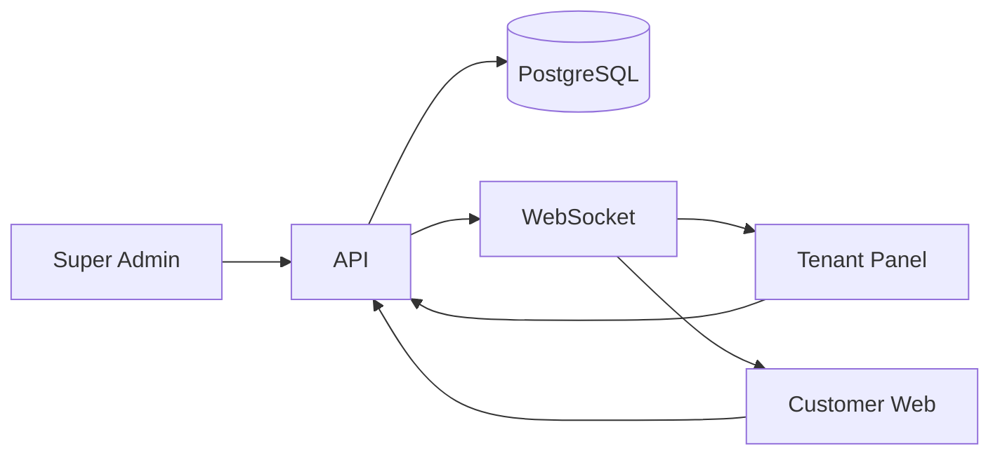

## 2. Jornada publica do cliente

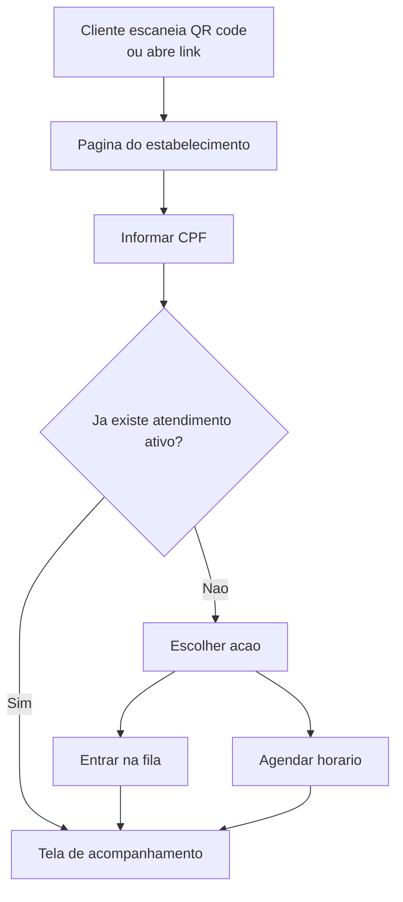

## 3. Fluxo de identificacao por CPF

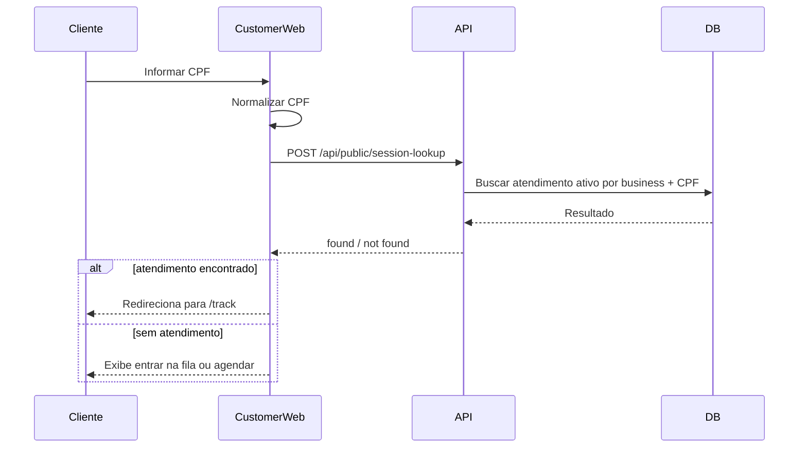

## 4. Fluxo de entrada na fila

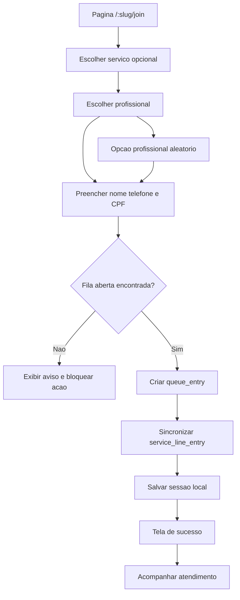

## 5. Fluxo de agendamento

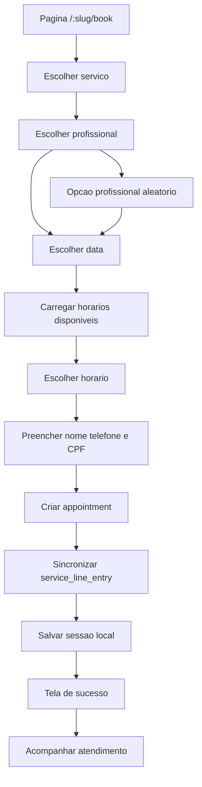

## 6. Fluxo de acompanhamento do cliente

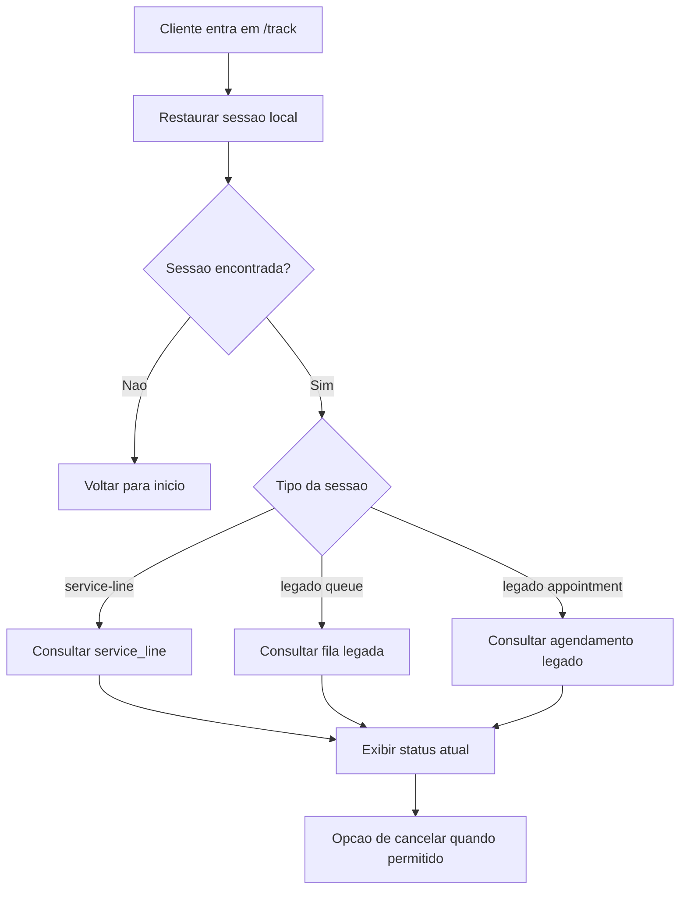

## 7. Fluxo operacional do tenant na fila

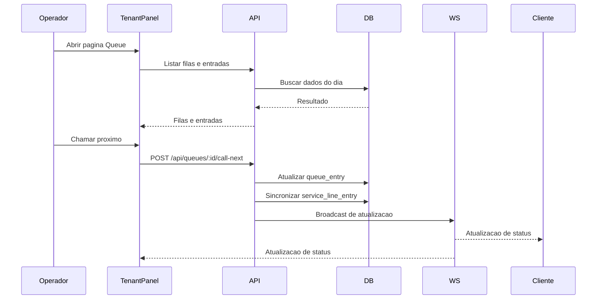

## 8. Fluxo de links e QR codes por estabelecimento

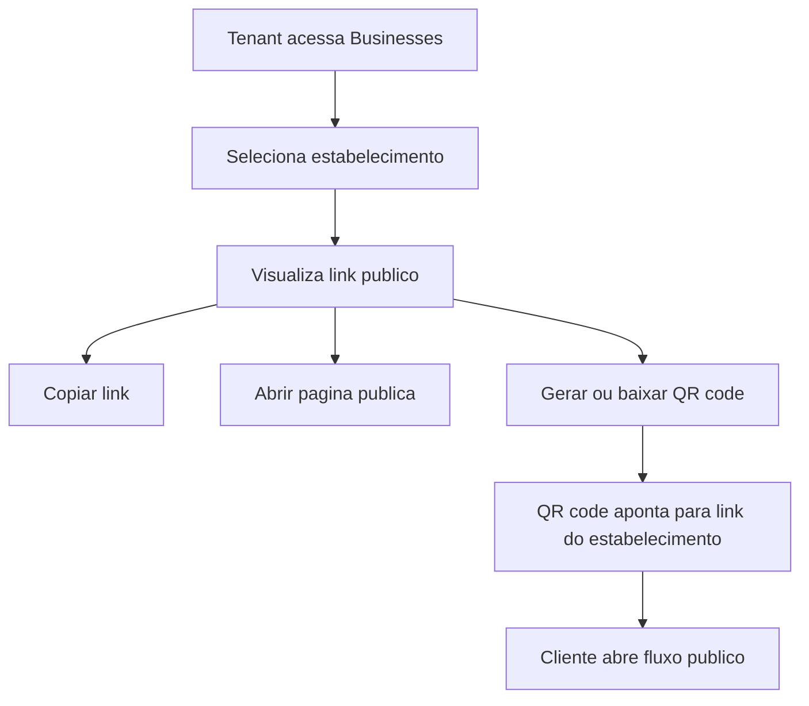

## 9. Fluxo do super admin

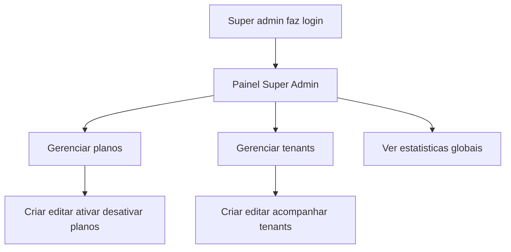

## 10. Fluxo tecnico da linha unificada

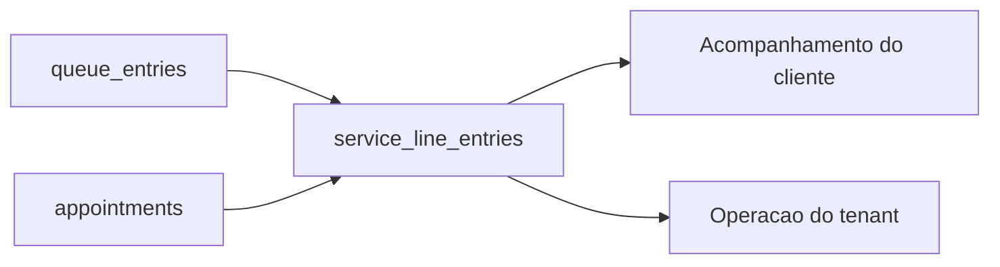

## 11. Fluxo de sincronizacao no backend

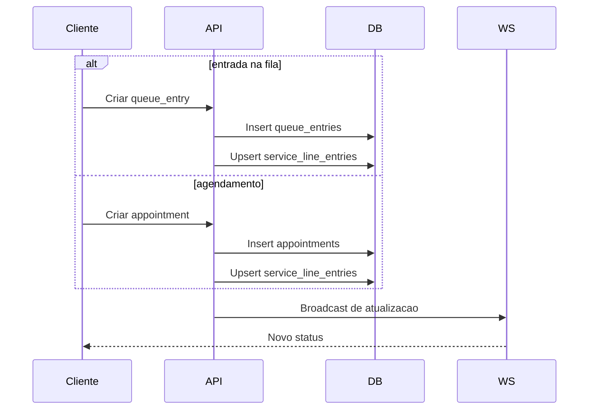

## 12. Estado atual da migracao funcional

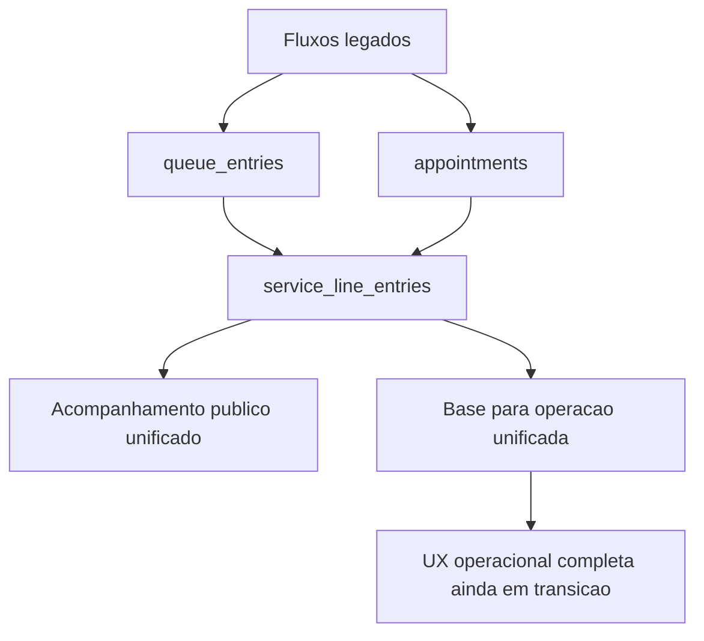

## Leitura recomendada em conjunto

- [Fluxos do Sistema e Status de Implementacao](./SYSTEM-FLOWS.md)
- [Plano da linha unificada por profissional](./UNIFIED-SERVICE-LINE-PLAN.md)
- [Publicacao local em localhost](./LOCALHOST.md)

# Fluxos do Sistema e Status de Implementacao

## Objetivo

Este documento consolida:

- os fluxos principais do sistema
- o que ja esta implementado
- o que mudou na evolucao recente
- o que ainda esta em transicao
- a referencia funcional que acompanha os diagramas visuais

Ele serve como referencia funcional para produto, operacao e desenvolvimento.

Os diagramas complementares estao em [SYSTEM-FLOW-DIAGRAMS.md](./SYSTEM-FLOW-DIAGRAMS.md).

## Visao geral

O sistema e uma plataforma SaaS multi-tenant para barbearias, saloes e negocios similares.

Existem 4 frentes principais:

1. `Super Admin`
2. `Tenant Panel`
3. `Customer Web`
4. `API + Banco + WebSocket`

## URLs locais

- Tenant panel: `http://localhost:5173`
- Super admin: `http://localhost:5174/super-admin/`
- Customer web: `http://localhost:5175`
- API: `http://localhost:8080/api`
- Healthcheck: `http://localhost:8080/api/healthz`

## Credenciais demo

- Super admin: `admin@admin.com` / `admin123`
- Tenant admin: `admin@salonchain.com` / `tenant123`
- Operator: `operator@salonchain.com` / `tenant123`

## Estabelecimentos demo

- `main-street-barbers`
- `glamour-beauty`
- `nail-art-studio`

Exemplos de links publicos:

- `http://localhost:5175/main-street-barbers`
- `http://localhost:5175/glamour-beauty`
- `http://localhost:5175/nail-art-studio`

## Arquitetura funcional

### Super Admin

Responsavel por:

- autenticar como administrador global
- criar e gerenciar planos
- criar e gerenciar tenants
- acompanhar estatisticas globais

### Tenant Panel

Responsavel por:

- autenticar usuarios do tenant
- gerenciar estabelecimentos
- gerenciar servicos
- gerenciar profissionais
- operar fila
- visualizar agendamentos
- configurar o tenant
- gerar e copiar links publicos e QR codes por estabelecimento

### Customer Web

Responsavel por:

- receber o cliente final via QR code ou link
- identificar o cliente pelo CPF
- redirecionar para acompanhamento se ja existir atendimento ativo
- permitir entrar na fila
- permitir agendar horario
- acompanhar o atendimento
- cancelar atendimento publico quando permitido

### Backend

Responsavel por:

- autenticar usuarios admin e tenant
- expor endpoints internos e publicos
- criar e atualizar filas, agendamentos e linha unificada
- enviar atualizacoes em tempo real via WebSocket
- persistir tudo em PostgreSQL

## Modelo de negocio implementado

### Regra principal

Cada profissional possui sua propria fila operacional.

O sistema agora tambem possui uma representacao unificada chamada `service_line_entries`, que compartilha a mesma linha logica para:

- atendimentos originados de fila
- atendimentos originados de agendamento

### O que isso significa na pratica

- o cliente pode entrar por `fila` ou `agendamento`
- internamente, ambos podem gerar uma entrada em `service_line_entries`
- o acompanhamento do cliente pode ser feito pela linha unificada
- cada profissional continua tendo sua propria fila/agenda

## Fluxos do cliente

## 1. Fluxo de entrada via QR code ou link

### Objetivo

Levar o cliente direto para a pagina do estabelecimento.

### Caminho

1. Cliente escaneia o QR code.
2. O QR aponta para o link publico do estabelecimento.
3. O cliente abre a pagina publica do negocio.
4. O sistema pede o CPF para identificar atendimento ativo.

### Implementado

- QR code por estabelecimento
- links publicos por slug do estabelecimento
- fluxo publico web via `customer-web`

### Observacoes

- a estrategia recomendada e `1 QR code por estabelecimento`
- a escolha do profissional acontece dentro do fluxo

## 2. Fluxo de identificacao por CPF

### Objetivo

Reconhecer rapidamente se o cliente ja possui atendimento ativo.

### Caminho

1. Cliente informa o CPF.
2. O sistema normaliza o CPF para apenas digitos.
3. A API consulta sessao ativa no estabelecimento.
4. Se existir atendimento ativo, o cliente vai direto para acompanhamento.
5. Se nao existir, o cliente segue para escolher `Entrar na fila` ou `Agendar`.

### Implementado

- lookup publico por CPF
- normalizacao de CPF
- reaproveitamento do CPF nos fluxos seguintes
- sessao local salva no navegador

### Endpoint relacionado

- `POST /api/public/session-lookup`

## 3. Fluxo de boas-vindas do estabelecimento

### Objetivo

Dar ao cliente uma decisao simples apos a identificacao.

### Caminho

1. Cliente entra na pagina do estabelecimento.
2. Se nao existir atendimento ativo, ve duas acoes principais:
   - `Entrar na fila`
   - `Agendar horario`
3. O CPF segue no contexto da navegacao.

### Implementado

- pagina publica por estabelecimento
- navegacao com preservacao do CPF
- escolha simples entre fila e agendamento

## 4. Fluxo de entrar na fila

### Objetivo

Permitir que o cliente entre na fila do profissional escolhido.

### Caminho

1. Cliente abre `/:slug/join`.
2. Pode escolher servico, se houver.
3. Pode escolher um profissional especifico.
4. Pode tocar em `Profissional aleatorio`.
5. Informa nome, telefone opcional e CPF.
6. O sistema localiza a fila aberta correta.
7. O sistema cria a `queue_entry`.
8. O sistema tenta localizar a `service_line_entry` correspondente.
9. O sistema salva a sessao local.
10. O cliente pode acompanhar o atendimento.

### Implementado

- tela publica de fila
- selecao de profissional
- botao `Profissional aleatorio`
- envio de CPF no ingresso da fila
- criacao de `queue_entry`
- sincronizacao com `service_line_entries`
- tela de sucesso com atalho para acompanhamento

### Regras atuais

- se houver profissionais, a escolha de profissional e obrigatoria
- a fila e encontrada de acordo com o profissional selecionado
- se nao houver fila aberta para aquele contexto, o botao de entrada fica bloqueado

## 5. Fluxo de agendamento

### Objetivo

Permitir agendar horario com um profissional especifico.

### Caminho

1. Cliente abre `/:slug/book`.
2. Escolhe um servico.
3. Escolhe um profissional ou `Profissional aleatorio`.
4. Escolhe a data.
5. Visualiza os horarios disponiveis do profissional.
6. Informa nome, telefone opcional e CPF.
7. O sistema cria o `appointment`.
8. O sistema sincroniza com `service_line_entries`.
9. O sistema salva a sessao local.
10. O cliente pode acompanhar o agendamento.

### Implementado

- tela publica de agendamento
- selecao de servico
- selecao de profissional
- botao `Profissional aleatorio`
- listagem de slots
- envio de CPF no agendamento
- criacao de `appointment`
- sincronizacao com `service_line_entries`
- tela de sucesso com atalho para acompanhamento

## 6. Fluxo de acompanhamento do cliente

### Objetivo

Manter o cliente informado sobre o status do atendimento.

### Caminho

1. O cliente entra em `/track`.
2. O sistema tenta restaurar a sessao local.
3. Se a sessao for da linha unificada, consulta `service_line`.
4. Se a sessao for antiga, ainda suporta fallback para fila ou agendamento.
5. O cliente ve status atual do atendimento.
6. O cliente pode cancelar quando a regra permitir.

### Implementado

- acompanhamento por sessao local
- suporte a `service-line`
- compatibilidade com sessoes antigas de fila/agendamento
- cancelamento publico de atendimento unificado

### Endpoints relacionados

- `GET /api/public/service-line/:id`
- `PATCH /api/public/service-line/:id`

## Fluxos operacionais do tenant

## 7. Fluxo de login do tenant

### Objetivo

Permitir autenticacao local do tenant sem depender de Clerk no modo localhost.

### Caminho

1. Usuario acessa o tenant panel.
2. Informa email e senha.
3. A API retorna token JWT local.
4. O token e salvo no `localStorage`.
5. O painel passa a autenticar as chamadas seguintes.

### Implementado

- login local por JWT
- persistencia da sessao
- exigencia de troca de senha no primeiro acesso quando aplicavel

## 8. Fluxo de dashboard

### Objetivo

Dar visao geral operacional do tenant.

### Implementado

- dashboard do tenant
- integracao com estatisticas e visoes basicas do negocio

## 9. Fluxo de gestao de estabelecimentos

### Objetivo

Permitir que o tenant administre suas unidades.

### Caminho

1. Usuario acessa `Businesses`.
2. Cadastra ou edita estabelecimentos.
3. Visualiza o link publico da unidade.
4. Copia o link.
5. Abre a pagina publica.
6. Gera ou baixa o QR code da unidade.

### Implementado

- CRUD de estabelecimentos
- exibicao de link publico
- copia de link
- abrir pagina publica
- QR code por estabelecimento

## 10. Fluxo de gestao de servicos

### Objetivo

Permitir configurar servicos ofertados pelo estabelecimento.

### Implementado

- CRUD de servicos
- duracao e informacoes operacionais usadas pelo agendamento

## 11. Fluxo de gestao de profissionais

### Objetivo

Permitir configurar profissionais que atendem no estabelecimento.

### Implementado

- CRUD de profissionais
- vinculo com servicos e operacao de fila/agendamento

## 12. Fluxo de operacao de fila

### Objetivo

Permitir que o tenant acompanhe e opere a fila do dia.

### Caminho

1. Usuario abre a pagina de fila.
2. Visualiza filas e entradas.
3. Chama o proximo cliente.
4. Atualiza status da entrada quando necessario.
5. O backend sincroniza a linha unificada.
6. O sistema pode emitir eventos em tempo real.

### Implementado

- pagina de fila no tenant panel
- listagem de filas e entradas
- chamada do proximo da fila
- atualizacao de status
- sincronizacao com `service_line_entries`
- integracao com WebSocket

### Observacao importante

O painel operacional ainda nao foi totalmente migrado para uma tela unica de linha unificada. Hoje existe compatibilidade e sincronizacao no backend, mas a UX principal ainda mistura conceitos legados de fila e agendamento.

## 13. Fluxo de visualizacao de agendamentos

### Objetivo

Permitir acompanhar os agendamentos criados.

### Implementado

- pagina de agendamentos no tenant panel
- listagem de agendamentos
- atualizacao de status
- sincronizacao com `service_line_entries`

## 14. Fluxo de configuracoes

### Implementado

- pagina de configuracoes do tenant
- alteracao de senha
- gestao basica de conta do tenant

## Fluxos do super admin

## 15. Fluxo de login do super admin

### Objetivo

Permitir autenticacao do administrador global da plataforma.

### Implementado

- login local via `/api/auth/admin/login`
- acesso ao painel em `/super-admin/`

## 16. Fluxo de planos SaaS

### Objetivo

Permitir gerenciar os planos comerciais da plataforma.

### Implementado

- listagem de planos
- criacao de planos
- edicao de planos
- suporte a limites operacionais como negocios e operadores

## 17. Fluxo de tenants

### Objetivo

Permitir criar e acompanhar tenants da plataforma.

### Implementado

- listagem de tenants
- criacao e edicao
- associacao com plano
- visualizacao global pelo super admin

## Fluxos tecnicos

## 18. Fluxo de autenticacao local sem Clerk

### Objetivo

Permitir ambiente local funcional mesmo sem chaves do Clerk.

### Implementado

- middleware do Clerk condicional
- fallback para JWT local
- error handler JSON na API

### Resultado

- localhost funciona sem dependencia obrigatoria de Clerk
- endpoints protegidos continuam operando localmente

## 19. Fluxo de banco e seed

### Objetivo

Subir rapidamente um ambiente pronto para demonstracao.

### Caminho

1. `docker compose` sobe o Postgres.
2. `db-init` aplica `drizzle push`.
3. `db-init` executa o seed.
4. O seed cria planos, tenant demo, businesses, services, professionals, queues, queue entries, appointments e service line entries.

### Implementado

- stack Docker completa
- init automatico de banco
- seed com dados demo
- CPFs demo
- `service_line_entries` demo

## 20. Fluxo de WebSocket

### Objetivo

Atualizar clientes e operacao em tempo real.

### Implementado

- inicializacao do WebSocket em `/api/ws`
- broadcast de atualizacao de fila
- broadcast de atualizacao de item de fila
- suporte de eventos para `service-line`

## Modelo de dados funcional

## 21. Entidades principais

### `plans`

Planos comerciais da plataforma.

### `tenants`

Clientes SaaS da plataforma.

### `businesses`

Unidades/estabelecimentos do tenant.

### `services`

Servicos prestados por um estabelecimento.

### `professionals`

Profissionais que atendem no estabelecimento.

### `queues`

Filas operacionais abertas no dia.

### `queue_entries`

Entradas individuais da fila.

### `appointments`

Agendamentos criados pelos clientes.

### `service_line_entries`

Representacao unificada do atendimento por profissional.

## 22. Status da linha unificada

### Ja implementado

- tabela `service_line_entries`
- `clientCpf` em fila e agendamento
- seed da linha unificada
- criacao automatica da linha ao entrar na fila
- criacao automatica da linha ao agendar
- sincronizacao de status entre origem e linha unificada
- lookup publico por CPF
- acompanhamento publico baseado em `service-line`

### Em transicao

- UX do tenant ainda nao e totalmente centrada na linha unificada
- ainda existe compatibilidade com fluxos antigos de fila/agendamento separados

### Ainda nao implementado por completo

- tela unica operacional por profissional usando somente a linha unificada
- modelo de cadastro basico persistente de cliente separado de CPF solto
- regras mais sofisticadas de prioridade entre fila e agendamento

## Problemas ja resolvidos na evolucao local

- subida completa via Docker
- frontends servidos por Nginx
- login local sem Clerk obrigatorio
- JSON de erro na API
- correcao de sincronizacao interna do Postgres no Docker
- criacao automatica da linha unificada
- links e QR codes por estabelecimento
- escolha de profissional no fluxo publico

## Pendencias recomendadas

1. Criar entidade `customers` para cadastro basico do cliente.
2. Reduzir ainda mais o numero de campos do fluxo publico.
3. Migrar a operacao do tenant para uma tela unica de linha por profissional.
4. Refinar a logica de prioridade entre agendamento e fila.
5. Criar documentacao visual complementar com diagramas por fluxo.

## Referencias tecnicas

- diagramas visuais dos fluxos: [SYSTEM-FLOW-DIAGRAMS.md](./SYSTEM-FLOW-DIAGRAMS.md)
- publicacao local: [LOCALHOST.md](./LOCALHOST.md)
- plano da linha unificada: [UNIFIED-SERVICE-LINE-PLAN.md](./UNIFIED-SERVICE-LINE-PLAN.md)
- documentacao geral do projeto: [README.md](./README.md)

